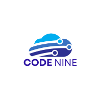

### ❄️ Yuri Braga ❄️  
---

### ❄️ **Sobre mim**  ❄️

  

  
Sou Yuri Braga, um entusiasta do mundo da tecnologia com 22 anos, atualmente no 3º semestre de Desenvolvimento de Software Multiplataforma na Fatec São José dos Campos.

  

  
<a href="https://www.linkedin.com/in/yuri-braga/">LinkedIn</a> ❄️ <a href="https://github.com/yuribragga">GitHub</a>  

  

---

### ❄️ **Projetos**  ❄️

</img>

####  **Criança Renal**  
**1º Semestre • 2/2023**  
**[Repositório Github e Documentação do Projeto](https://github.com/Code-Nine-FTC/Grupo-Code-Nine)**  

- **Parceiro Acadêmico:** [Faculdade de Tecnologia de São José dos Campos](https://fatecsjc-prd.azurewebsites.net/)  
- **Objetivo:** Criar uma plataforma que sensibilize a sociedade sobre os desafios enfrentados por pais de crianças com Doença Renal Crônica (DRC). A solução também oferece acesso a informações úteis, incluindo localização de hospitais especializados, dados de tratamento no Brasil e um forúm.

#### **Tecnologias Utilizadas**  
- **[Figma](https://www.figma.com/):** Design e prototipação de interfaces.  
- **[HTML, CSS, JS](https://www.w3.org/standards/):** Estruturação e estilização da página web.  
- **[Python e Flask](https://flask.palletsprojects.com/en/3.0.x/):** Desenvolvimento da lógica de negócio.  
- **[MySQL](https://www.mysql.com/):** Sistema de Gerenciamento de Banco de Dados (SGBD).  

#### **Contribuições Pessoais**  
- **Scrum Master:** Organizei sprints, reuniões diárias e resolvi impedimentos, garantindo entregas ágeis.  
- **Desenvolvimento de Funcionalidades:**  
  - Criação de Usuários (Cadastro e Login)  
  - Estilização de páginas, visando melhorar a experiência do usuário
  - Raspagem de dados de hospitais especializados

#### **Lições Aprendidas**  
O primeiro semestre foi desafiador, mas profundamente enriquecedor. Aprendi a valorizar a **comunicação**, a **colaboração** e a **resiliência**, habilidades fundamentais ao trabalhar com novas tecnologias e em um grupo de pessoas inicialmente desconhecidas. A conclusão bem-sucedida do projeto foi uma realização coletiva significativa, reforçando o poder do trabalho em equipe e da superação conjunta.

---

</img>

####  **Gestão de Chamadas de Serviços**  
**2º Semestre • 1/2024**  
**[Repositório Github e Documentação do Projeto](https://github.com/Code-Nine-FTC/API-2024.1)**  

- **Parceiro Acadêmico:** [Faculdade de Tecnologia de São José dos Campos](https://fatecsjc-prd.azurewebsites.net/)  
- **Objetivo:** Desenvolver um sistema para planejar, monitorar e gerenciar chamadas de serviços, com diferentes níveis de permissões e controle eficiente de processos.  

#### **Tecnologias Utilizadas**  
- **[MySQL](https://www.mysql.com/):** Gerenciamento eficiente de dados.  
- **[JavaScript, TypeScript e Node.js](https://nodejs.org/en):** Lógica de negócios robusta.  
- **[React](https://react.dev/):** Criação de interfaces interativas.  
- **[CSS](https://developer.mozilla.org/en-US/docs/Web/CSS):** Estilização para uma experiência visual intuitiva.  

#### **Contribuições Pessoais**  
- Estilização das páginas (Perfil do usuário, lista de chamados entre outros).
- Desenvolvimento de funcionalidades de edição, listagem e armazenamento de dados.  
- Atuação principal no frontend  

#### **Lições Aprendidas**  
Este projeto foi uma grande oportunidade para crescer no frontend e entender, na prática, a importância da **organização de tarefas** dentro da metodologia ágil Scrum. Trabalhar com prazos desafiadores e um time tão engajado me mostrou como equilibrar o aprendizado técnico com o desenvolvimento de soft skills, tudo para alcançar metas que, no início, pareciam bem ambiciosas.

---

</img>

#### ❄️ **Portal de Transparência FAPG**  
**3º Semestre • 2/2024**  

**[Repositório Github e Documentação do Projeto](https://github.com/Sync-FATEC/API-2024.2-3SEM)**  

Parceiro Acadêmico: <a href="https://fapg.org.br/">FAPG</a>

- **Parceiro Acadêmico:** [FAPG](https://fapg.org.br/)  
- **Objetivo:** Criar uma plataforma que permita a inserção, consulta e transparência de dados de projetos realizados, garantindo o cumprimento de exigências legais.  

#### **Tecnologias Utilizadas**  
- **[React](https://react.dev/):** Interface de usuário moderna e interativa.  
- **[Spring Boot](https://spring.io/projects/spring-boot):** Backend robusto e eficiente.  
- **[Python](https://www.python.org/):** Automação de integrações no backend.  
- **[MySQL](https://www.mysql.com/):** Banco de dados para gerenciamento seguro e estruturado.  

#### **Contribuições Pessoais**  
- Desenvolvimento de lógica para importação de dados, garantindo integridade e continuidade das informações.  
- Criação de dashboards e relatórios para monitoramento detalhado do progresso dos projetos.  
- Implementação de uma interface intuitiva para pesquisas avançadas.  
- Principal atuação no frontend, organizando e melhorando a experiência do usuário

#### **Lições Aprendidas**  
Aprendi o quanto um **planejamento eficaz** e uma boa **gestão de tempo** fazem diferença na entrega de um projeto robusto, mesmo com demandas intensas. Colaborar com equipes multidisciplinares e explorar tecnologias avançadas foi uma experiência que me preparou para enfrentar desafios reais do mercado. 

---

**🔗 [Voltar para o início](#sumário)**  
